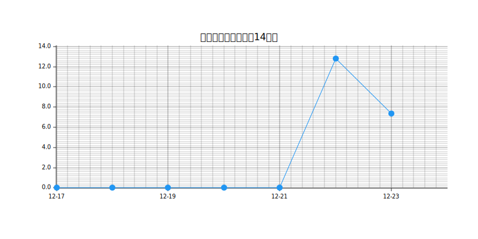

# Suno API 使用量统计

这个仓库用于追踪 Suno API 的使用情况，每两小时自动更新一次数据。

## 使用统计

| 指标 | 数值 |
|------|------|
| 日平均消耗 | 4.08 |
| 预计剩余天数 | 12.0 |

## 使用量走势

## 每日消耗统计

| 日期 | 当日消耗量 | 累计使用量 | 剩余额度 |
|------|------------|------------|-----------|
| 2024-12-11 | 8.99 | 53.07 | 48.93 |
| 2024-12-10 | 0.00 | 44.08 | 57.92 |
| 2024-12-09 | 0.29 | 44.08 | 57.92 |
| 2024-12-08 | 0.58 | 43.79 | 58.21 |
| 2024-12-07 | 1.16 | 43.21 | 58.79 |
| 2024-12-06 | 0.00 | 42.05 | 59.95 |
| 2024-12-05 | 2.03 | 42.05 | 59.95 |
| 2024-12-04 | 15.08 | 40.02 | 61.98 |
| 2024-12-02 | 6.09 | 24.94 | 77.06 |
| 2024-12-01 | 7.54 | 18.85 | 83.15 |
| 2024-11-30 | 0.00 | 11.31 | 90.69 |
| 2024-11-29 | 0.29 | 11.31 | 90.69 |
| 2024-11-28 | 11.02 | 11.02 | 90.98 |

## 说明

- 当日消耗量：当天的使用量相比前一天的增加值
- 累计使用量：从开始统计到当天的总使用量
- 剩余额度：当天的剩余可用额度

数据每两小时自动更新一次，通过 GitHub Actions 自动运行。