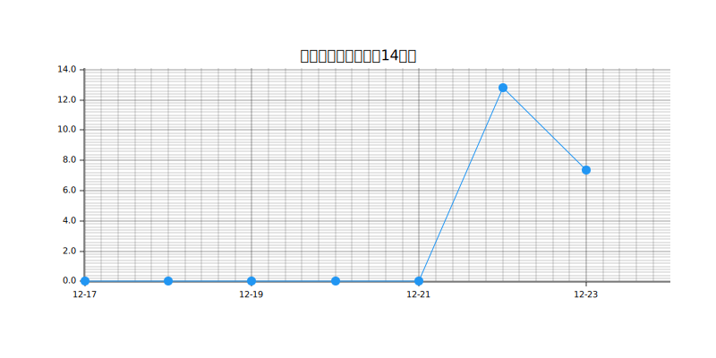

# Suno API 使用量统计

这个仓库用于追踪 Suno API 的使用情况，每两小时自动更新一次数据。

## 使用统计

| 指标 | 数值 |
|------|------|
| 日平均消耗 | 2.70 |
| 预计剩余天数 | 31.7 |

## 使用量走势

## 每日消耗统计

| 日期 | 当日消耗量 | 剩余额度 |
|------|------------|-----------|
| 2024-12-23 | 6.08 | 85.39 |
| 2024-12-22 | 12.80 | 91.47 |
| 2024-12-21 | 0.00 | 104.27 |
| 2024-12-20 | 0.00 | 104.27 |
| 2024-12-19 | 0.00 | 104.27 |
| 2024-12-18 | 0.00 | 104.27 |
| 2024-12-17 | 0.00 | 104.27 |

## 说明

- 当日消耗量：当天剩余额度相比前一天剩余额度的减少值
- 剩余额度：当天的剩余可用额度

数据每两小时自动更新一次，通过 GitHub Actions 自动运行。