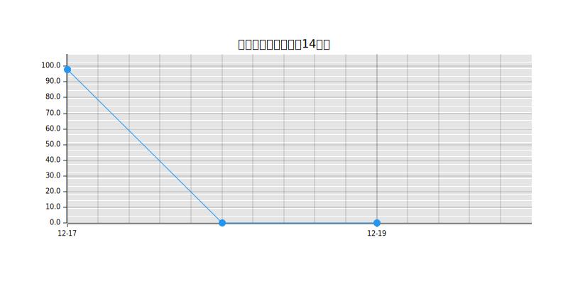

# Suno API 使用量统计

这个仓库用于追踪 Suno API 的使用情况，每两小时自动更新一次数据。

## 使用量走势

## 每日消耗统计

| 日期 | 当日消耗量 | 累计使用量 | 剩余额度 |
|------|------------|------------|-----------|
| 2024-12-03 | 5.80 | 35.67 | 66.33 |
| 2024-12-02 | 11.02 | 29.87 | 72.13 |
| 2024-12-01 | 7.54 | 18.85 | 83.15 |
| 2024-11-30 | 0.00 | 11.31 | 90.69 |
| 2024-11-29 | 0.29 | 11.31 | 90.69 |
| 2024-11-28 | 11.02 | 11.02 | 90.98 |

## 说明

- 当日消耗量：当天的使用量相比前一天的增加值
- 累计使用量：从开始统计到当天的总使用量
- 剩余额度：当天的剩余可用额度

数据每两小时自动更新一次，通过 GitHub Actions 自动运行。